# Guia de diagramas Mermaid para o DAS

Guia autocontido para os diagramas embutidos no DAS. Não depende de nenhum
arquivo fora deste diretório. Para os símbolos usados nos exemplos abaixo, veja
[`symbols.md`](symbols.md).

## Quando usar cada tipo

| Seção do DAS | Campo | Diagrama | Quando |
|---|---|---|---|
| §2 Visão da Solução (por jornada) | "Diagrama de Contexto" | C4 Context / Nível C1 (flowchart) | Sempre — um por jornada |
| §5 Desenho da solução (por jornada) | "Diagrama Container" | C4 Container / Nível C2 (flowchart) | Sempre — um por jornada, refinando o Context correspondente |
| §5 Desenho da solução (adicional) | — | Sequência (sequenceDiagram) | Quando a jornada envolve troca explícita de mensagens/eventos/API entre dois ou mais sistemas |

Regra: **um diagrama = um conceito**. Nunca combine Context e Container da
mesma jornada no mesmo bloco Mermaid — são blocos separados em §2 e §5, ligados
pelos campos "Container de Referência" (em §2) e "Contexto de Referência" (em
§5).

## C4 Context (nível §2)

Mostra a jornada como processo: o sistema em foco, os atores que interagem com
ele e os sistemas externos dos quais ele depende — sem detalhar componentes
internos.

**Inclua:**
- O sistema da jornada (uma única caixa, dentro de uma fronteira/subgraph).
- Atores/personas que interagem com o sistema.
- Sistemas externos dos quais o sistema depende.
- Relacionamentos e protocolos/canais usados em cada seta.

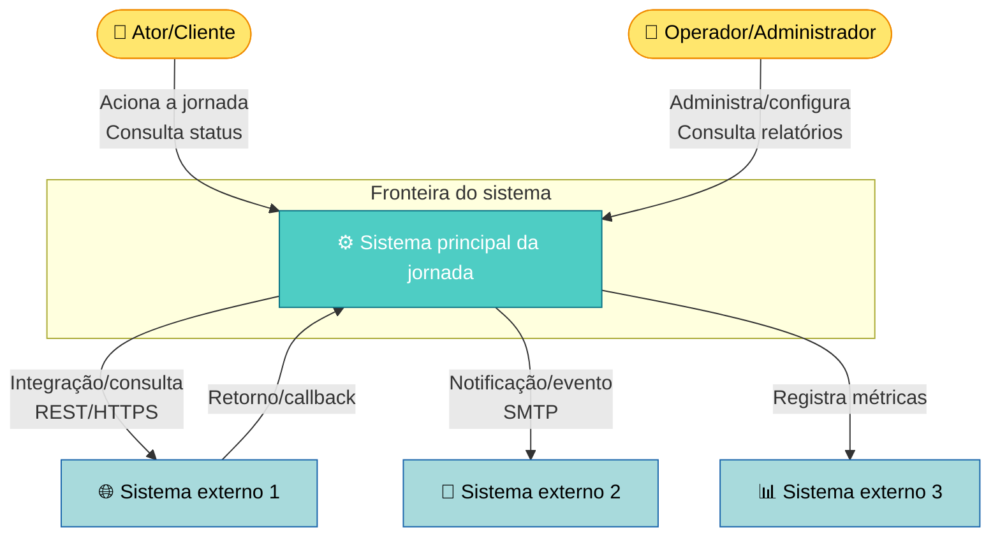

**Características-chave:**
- Uma única caixa para o sistema em foco.
- Fronteira do sistema explícita (`subgraph`).
- Todos os atores e sistemas externos relevantes aparecem.
- Protocolos/canais de comunicação rotulados nas setas.
- Nem todo Context precisa dos três sistemas externos do exemplo — use quantos
  a jornada realmente tiver (mínimo um: o próprio ator).

## C4 Container (nível §5)

Refina o Context correspondente mostrando os componentes/serviços internos do
sistema principal da jornada: aplicações, serviços de backend, bancos de
dados, cache e integrações com sistemas externos.

**Inclua:**
- Aplicações web/mobile que iniciam a jornada.
- Serviços de backend (API, serviço de negócio, workers).
- Bancos de dados e cache.
- Fila de mensagens/eventos, se a jornada usar mensageria assíncrona.
- Tecnologia de cada container (linguagem/framework, porta, protocolo).

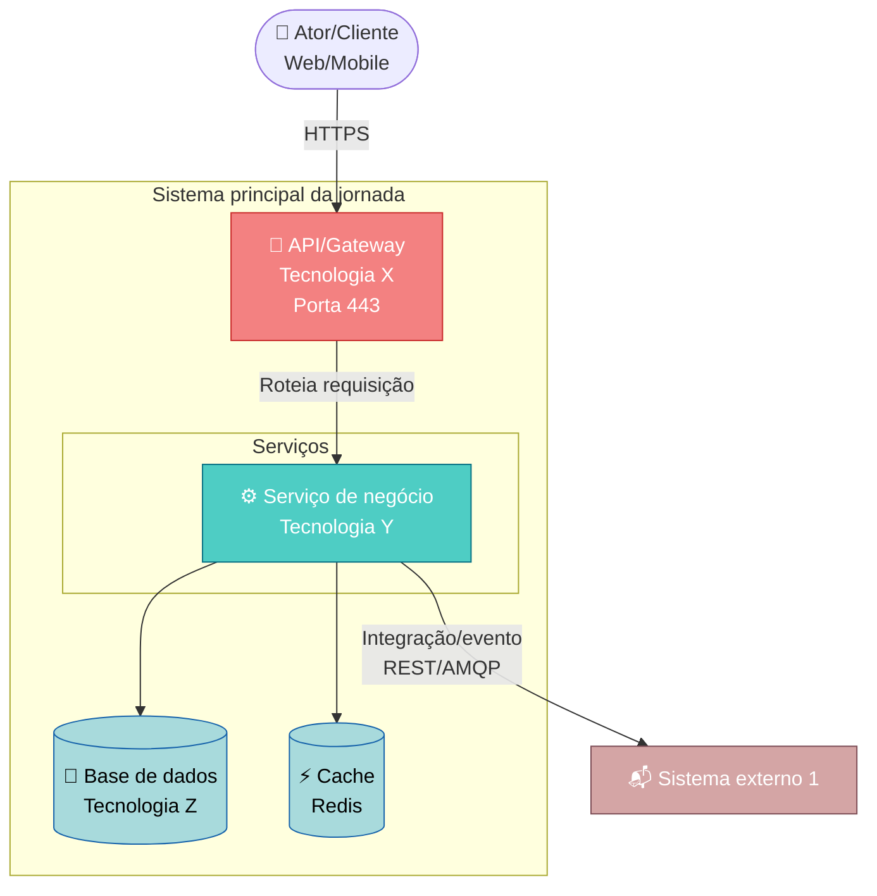

**Rótulos de tecnologia:** sempre inclua, quando conhecido:
- Linguagem/framework do serviço.
- Porta (se relevante para integração).
- Tecnologia do banco/cache.
- Protocolo de comunicação (REST, AMQP, SOAP, etc.).

## Sequência (nível §5, quando aplicável)

Use quando for necessário mostrar a ordem temporal das chamadas entre
sistemas — especialmente jornadas com API síncrona, mensageria assíncrona, ou
um ponto de atenção conhecido (conflito, retry, indisponibilidade).

### Elementos básicos

Participantes aparecem como linhas de vida verticais:

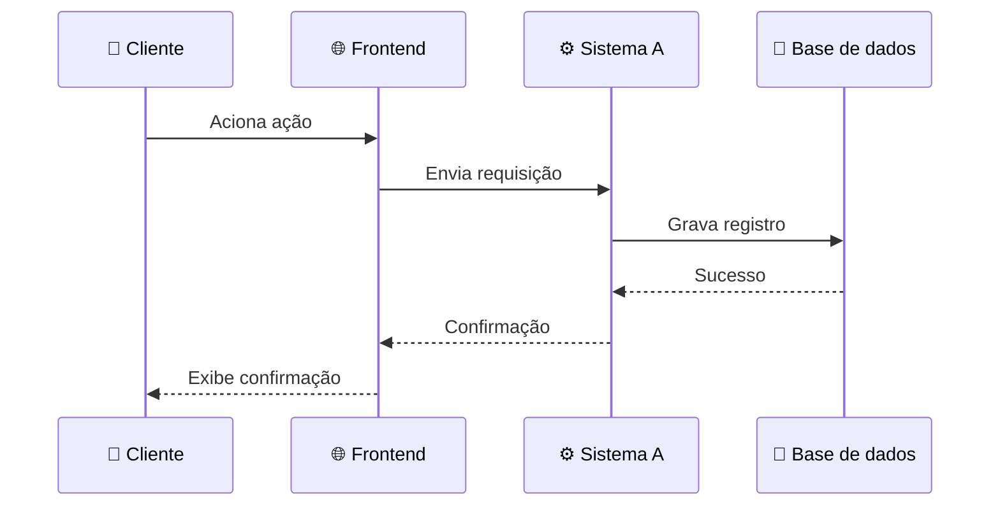

**Tipos de participante:**

| Símbolo | Tipo | Exemplo |
|---|---|---|
| 👤 | Pessoa/ator | Cliente, Operador |
| 🌐 | Web/frontend | App web, navegador, app mobile |
| ⚙️ | Serviço/backend | API, microsserviço |
| 💾 | Base de dados | PostgreSQL, MongoDB, Redis |
| 📬 | Fila de mensagens | RabbitMQ, Kafka, SQS |
| 🔐 | Serviço de autenticação | OAuth, Auth0, Keycloak |
| 🚪 | Gateway | API Gateway, Load Balancer |

**Tipos de mensagem** — síncrona, assíncrona e chamada interna:

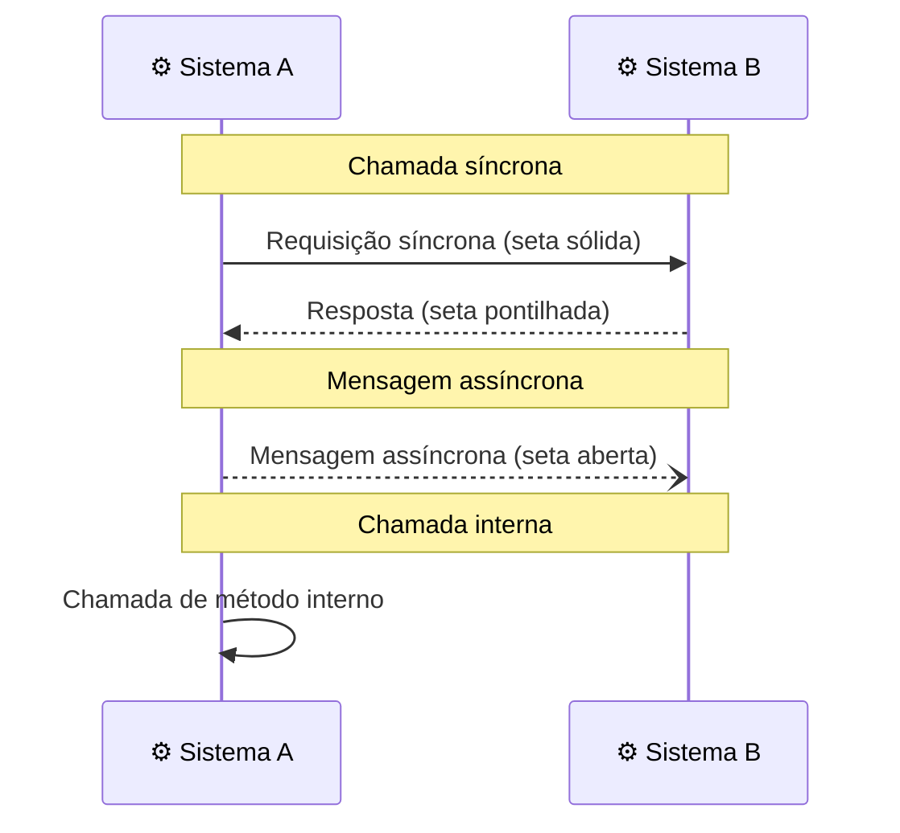

**Caixas de ativação** — mostram quando um participante está processando
ativamente. Todo `+` que abre uma ativação precisa de um `-` correspondente
que a fecha na mesma linha de vida:

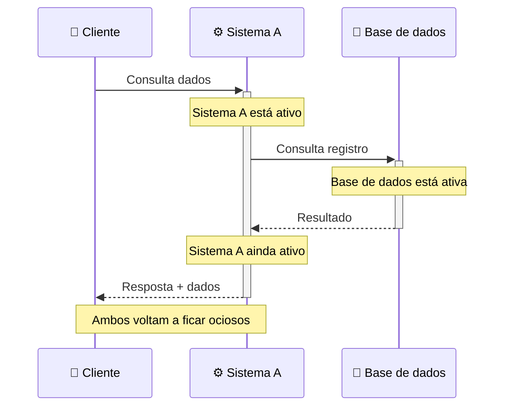

**Indicar síncrono vs. assíncrono** — use estilos de seta diferentes:

- **Seta sólida `->>`:** síncrono (espera resposta).
- **Seta aberta `--)`:** assíncrono (dispara e não espera).
- **Seta pontilhada `-->>`:** retorno/resposta.

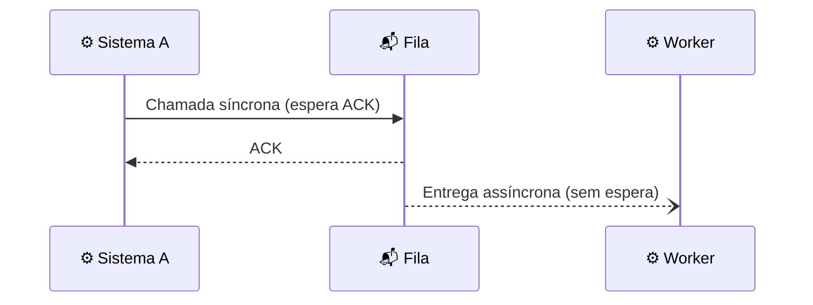

### Caminho feliz

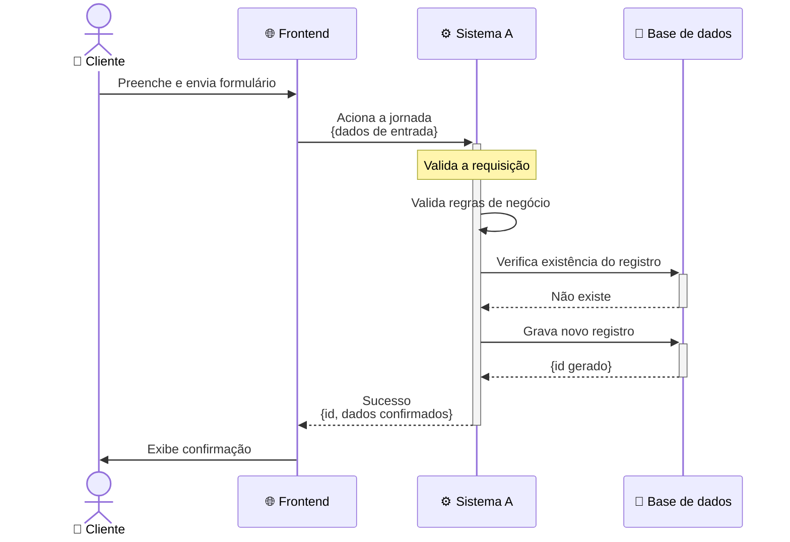

### Caminho de erro/compensação

Use quando a jornada tiver um ponto de atenção conhecido (ligue ao campo
"Pontos de atenção" em §3.1 do DAS) — conflito de concorrência, validação que
pode falhar, ou indisponibilidade de um sistema externo:

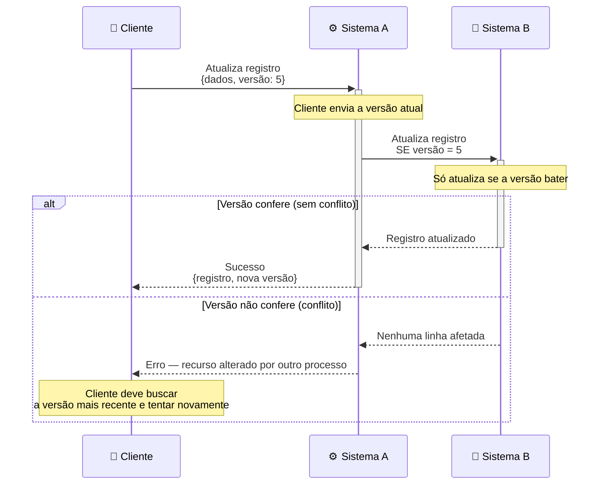

## Regras obrigatórias

- **Alto contraste:** todo `classDef` deve incluir a propriedade `color:`
  explícita. Fundo claro → texto escuro; fundo escuro → texto claro.
- **IDs sem espaços:** use camelCase ou PascalCase nos IDs dos nós (ex.:
  `SistemaPrincipal`, não `Sistema Principal`).
- **Rótulos com caracteres especiais:** envolva em aspas duplas quando a label
  tiver parênteses, vírgulas ou dois-pontos (ex.: `A["Processo (principal)"]`).
- **Nunca use `;` em texto de mensagem/`Note` de `sequenceDiagram`:** mesmo
  fora de colchetes, `;` é interpretado como separador de statement e quebra o
  diagrama. Use vírgula, travessão ou ponto no lugar (veja
  [Erros comuns](#erros-comuns)).
- **Símbolos semânticos (Unicode):** use para reforçar o tipo de nó — veja o
  guia completo em [`symbols.md`](symbols.md).
- **Nomes reais:** substitua os nomes genéricos do exemplo (Sistema A, Sistema
  externo 1, etc.) pelos nomes reais fornecidos pela origem do DAS.

## Erros comuns

### Palavras reservadas como identificador

Palavras como `end`, `style`, `class`, `subgraph`, `click`, `graph`,
`default`, `classDef`, `linkStyle`, `call` quebram o parser quando usadas sem
aspas como ID de nó.

Incorreto:
```mermaid
flowchart TD
    start --> end
    call --> style
```

Correto:
```mermaid
flowchart TD
    start --> "end"
    "call" --> "style"
```

### Caracteres especiais não escapados

Aspas duplas, parênteses, colchetes, chaves, barra invertida, dois-pontos,
vírgula, `#`, `%` e `@` em rótulos precisam estar entre aspas duplas.

Incorreto:
```mermaid
flowchart TD
    A[Diz "olá"]
    B[Objeto(x,y)]
```

Correto:
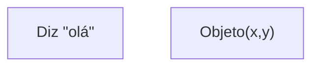

Regra prática: quando tiver dúvida, envolva o rótulo inteiro em aspas duplas.

### Ponto-e-vírgula em texto de mensagem/Note (sequenceDiagram)

Em `sequenceDiagram`, `;` funciona como separador de statement — igual a uma
quebra de linha — **mesmo dentro do texto de uma mensagem ou `Note`**, e mesmo
sem colchetes. Envolver em aspas não resolve (o texto de mensagem/Note não é
um label entre colchetes). O parser corta a linha no `;` e o restante do texto
sobra como um statement inválido, geralmente com erro `... got 'NEWLINE'` uma
ou duas linhas depois do `;` real.

Incorreto:
```mermaid
sequenceDiagram
    participant A as ⚙️ Sistema A
    A->>A: Nada
    Note over A: Motivo opcional; sem reabertura no MVP
```

Correto (evite `;` no texto — troque por vírgula, travessão ou ponto):
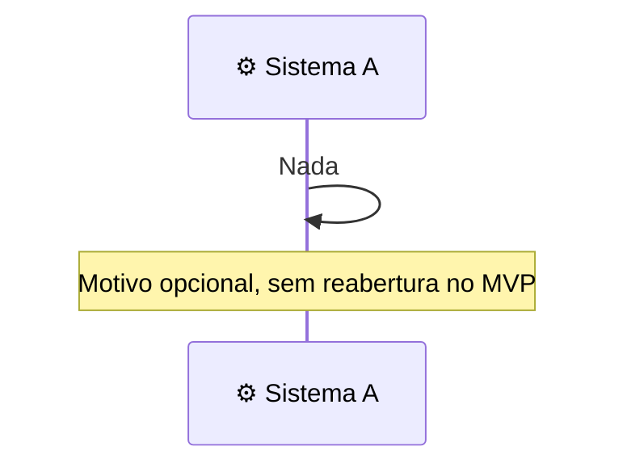

Alternativa (se o `;` for indispensável no texto): use a entidade `#59;` em
vez do caractere literal, ex.: `Note over A: Motivo#59; sem reabertura`. Na
prática, prefira reescrever a frase sem `;` — é mais legível.

### Sintaxe inválida de classDef

`classDef` não aceita chaves `{}` nem ponto-e-vírgula — apenas pares
`propriedade:valor` separados por vírgula ou espaço.

Incorreto:
```mermaid
flowchart TD
    classDef minhaClasse {
        fill: #ff0000;
        stroke: #333;
    }
```

Correto:
```mermaid
flowchart TD
    classDef minhaClasse fill:#ff0000,stroke:#333,color:#fff
```

### Ativação (+/-) sem pareamento

Cada `+` que abre uma caixa de ativação (`->>+Participante`) precisa de um `-`
correspondente que a fecha (`-->>-Participante`) mais adiante na mesma linha
de vida. Ativação aberta sem fechamento (ou fechada sem ter sido aberta) quebra
o diagrama ou deixa a caixa "vazando" visualmente até o fim.

Incorreto:
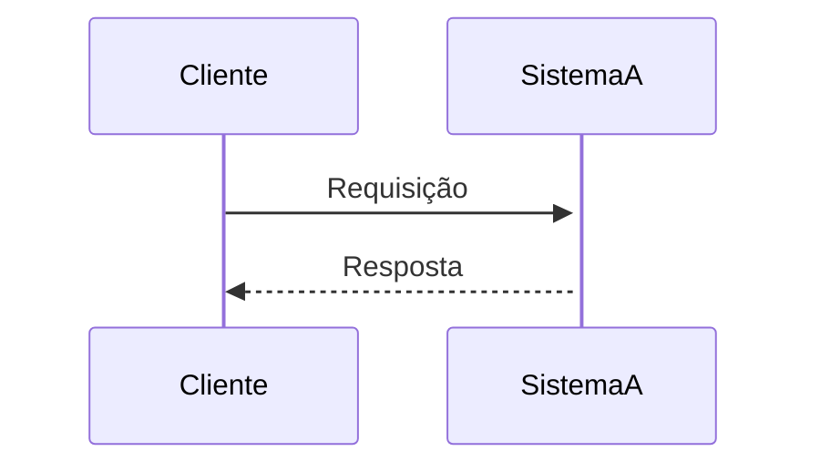

Correto:
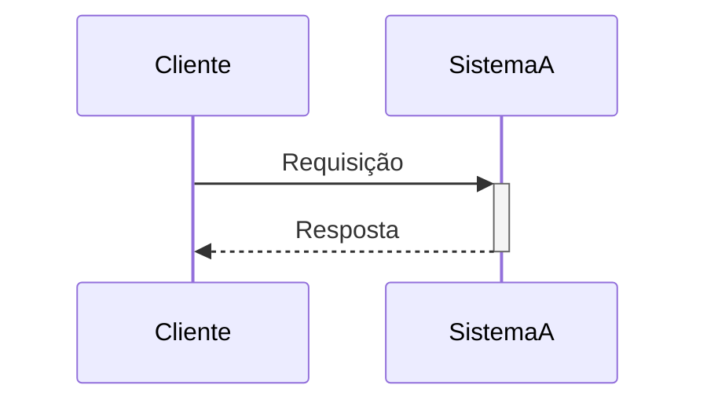

## Fora do padrão deste DAS

- Não gerar arquivos `.mmd` separados nem pasta `diagrams/` como parte do
  fluxo padrão — os diagramas ficam embutidos como blocos ` ```mermaid ` no
  próprio `.md`.
- Exportar o documento completo para PDF é suportado sob demanda via
  [`../scripts/das_to_pdf.py`](../scripts/das_to_pdf.py) (que internamente usa
  `mmdc` para renderizar cada diagrama) — ver
  [`pdf-export.md`](pdf-export.md). Não é um passo automático das Fases 1-6;
  só roda se o usuário pedir explicitamente um PDF.
