# Guia de símbolos Unicode para o DAS

Referência autocontida de símbolos semânticos para usar nos diagramas Mermaid
do DAS ([`diagrams.md`](diagrams.md)). Não depende de nenhum arquivo fora
deste diretório.

Use símbolos para reforçar visualmente o **tipo** de nó (ator, sistema,
armazenamento, mensageria, segurança, status), sempre combinados com texto —
nunca como substituto do rótulo.

## Computação & Processamento (⚙️ ⚡ 🔄)

| Símbolo | Significado | Exemplo de uso |
|---|---|---|
| ⚙️ | Processo/serviço/configuração | `[⚙️ Serviço de negócio]` |
| ⚡ | Rápido/tempo real/cache | `[⚡ Cache Redis]` |
| 🔄 | Sincronização/retry/processo circular | `[🔄 Serviço de sincronização]` |
| ♻️ | Reprocessamento | `[♻️ Fila de retry]` |
| 🚀 | Início/deploy | `[🚀 Processo de inicialização]` |
| 🔥 | Crítico/caminho quente | `[🔥 Caminho crítico]` |
| 💨 | Rápido/leve | `[💨 Resposta imediata]` |

**Exemplo:**
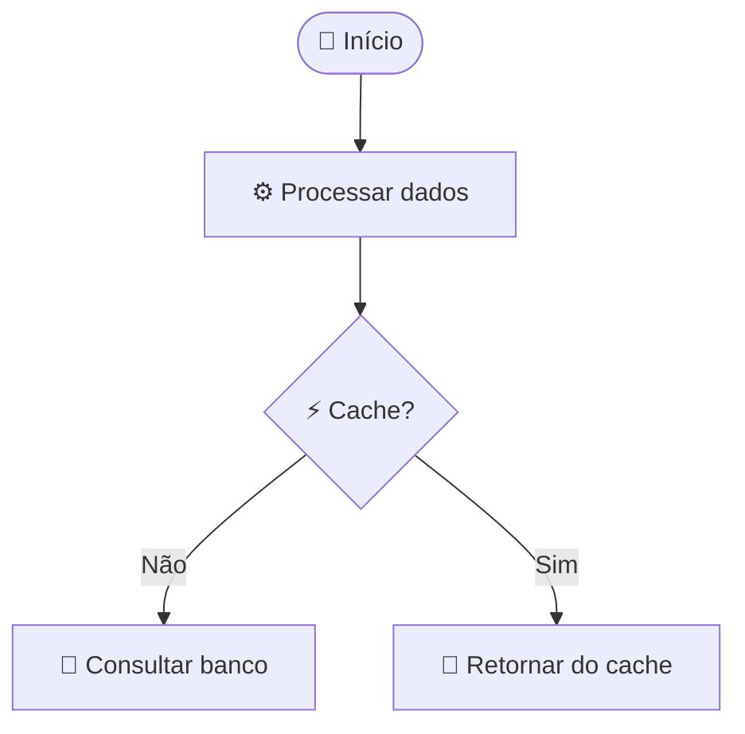

## Dados & Armazenamento (💾 📦 📊)

| Símbolo | Significado | Exemplo de uso |
|---|---|---|
| 💾 | Banco de dados/armazenamento persistente | `[(💾 PostgreSQL)]` |
| 📦 | Armazenamento de objetos/pacote | `[📦 Bucket de arquivos]` |
| 📊 | Dados/analytics/métricas | `[📊 Base analítica]` |
| 📈 | Crescimento/tendência de alta | `[📈 Painel de métricas]` |
| 📉 | Queda/tendência de baixa | `[📉 Taxa de erro]` |
| 🗃️ | Arquivo/histórico | `[🗃️ Armazenamento de histórico]` |
| 🧊 | Armazenamento frio | `[🧊 Cold storage]` |

**Exemplo:**
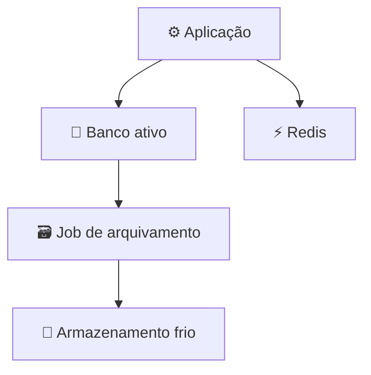

## Mensageria & Eventos (📨 📬 📢)

| Símbolo | Significado | Exemplo de uso |
|---|---|---|
| 📨 | Evento/mensagem/e-mail | `[📨 Barramento de eventos]` |
| 📬 | Fila/caixa de mensagens | `[📬 Fila de mensagens]` |
| 📤 | Envio/saída | `[📤 Mensagens de saída]` |
| 📥 | Recebimento/entrada | `[📥 Eventos recebidos]` |
| 📢 | Broadcast/notificação | `[📢 Notificações push]` |
| 📲 | Push mobile | `[📲 Alertas mobile]` |

**Exemplo:**
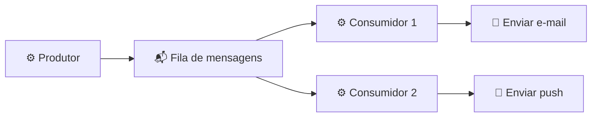

## Segurança & Autenticação (🔐 🔑 🛡️)

| Símbolo | Significado | Exemplo de uso |
|---|---|---|
| 🔐 | Segurança/criptografia/autenticação | `[🔐 Serviço de autenticação]` |
| 🔑 | Chave/segredo/credencial | `[🔑 Cofre de segredos]` |
| 🛡️ | Proteção/firewall/WAF | `[🛡️ Gateway de segurança]` |
| 🚪 | Gateway/ponto de entrada | `[🚪 API Gateway]` |
| 👤 | Usuário/pessoa | `[👤 Usuário final]` |
| 👥 | Grupo de usuários | `[👥 Pool de usuários]` |
| 🎫 | Token/ticket | `[🎫 Token JWT]` |
| 🔓 | Desbloqueado/público | `[🔓 API pública]` |

**Exemplo:**
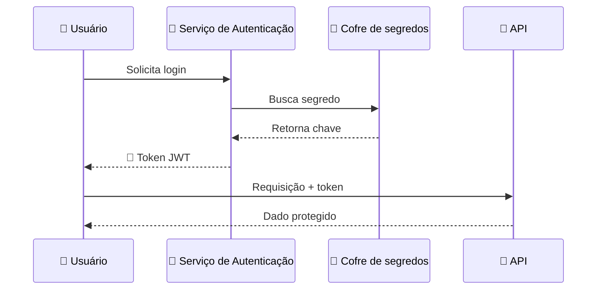

## Status & Estado (✅ ❌ ⏸️)

| Símbolo | Significado | Exemplo de uso |
|---|---|---|
| ✓ / ✅ | Sucesso/completo/aprovado | `[✅ Aprovado]` |
| ❌ / ✗ | Falha/rejeitado/erro | `[❌ Falhou]` |
| ⏸️ | Pausado/suspenso | `[⏸️ Pausado]` |
| ▶️ | Em execução/ativo | `[▶️ Em execução]` |
| ⏹️ | Parado/finalizado | `[⏹️ Finalizado]` |
| 🔴 | Crítico/indisponível | `[🔴 Serviço indisponível]` |
| 🟢 | Disponível/saudável | `[🟢 Serviço disponível]` |
| 🟡 | Alerta/degradado | `[🟡 Degradado]` |
| ⭕ | Pendente/aguardando | `[⭕ Pendente]` |

**Exemplo:**
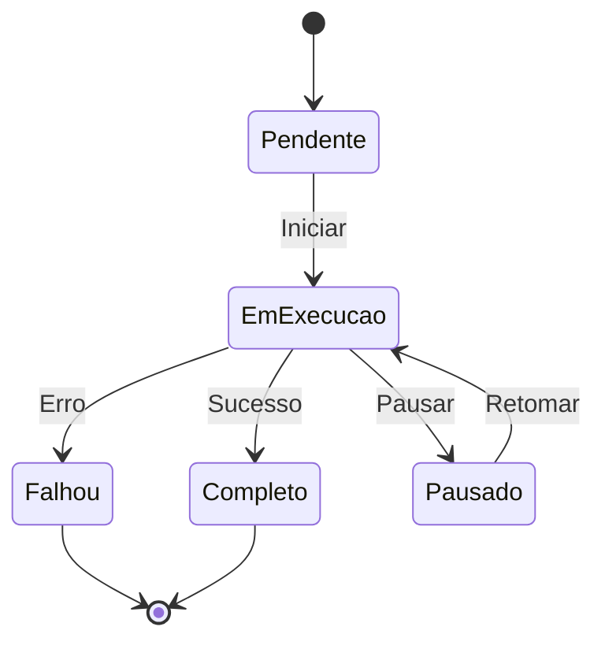

## Negócio & Domínio (💰 🛒 📋)

| Símbolo | Significado | Exemplo de uso |
|---|---|---|
| 💰 | Pagamento/dinheiro | `[💰 Gateway de pagamento]` |
| 🛒 | Compra/carrinho | `[🛒 Carrinho de compras]` |
| 📋 | Pedido/lista | `[📋 Gestão de pedidos]` |
| 📦 | Produto/pacote | `[📦 Catálogo de produtos]` |
| 🏢 | Empresa/organização | `[🏢 Empresa]` |
| 🏦 | Financeiro/banco | `[🏦 Integração bancária]` |
| 📧 | E-mail/comunicação | `[📧 Serviço de e-mail]` |
| 🎁 | Recompensa/bônus | `[🎁 Programa de fidelidade]` |

**Exemplo:**
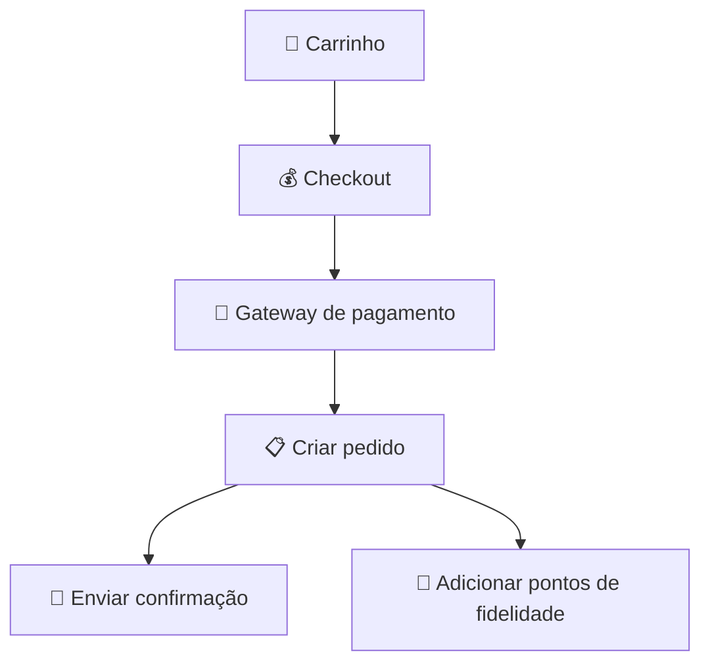

## Regras de uso

### 1. Consistência

Use o mesmo símbolo para o mesmo conceito em todos os diagramas do documento.

Bom — consistente:
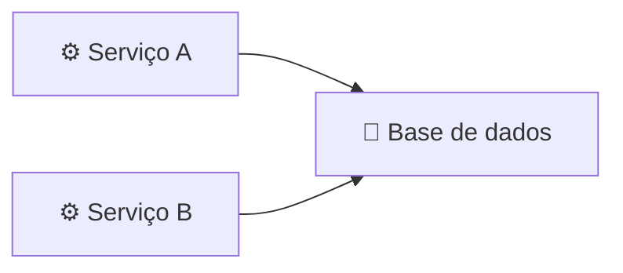

Ruim — inconsistente (símbolo diferente para o mesmo conceito):
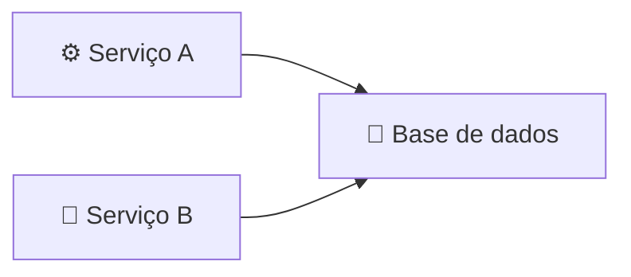

### 2. Não exagere

Um ou dois símbolos por nó é o ideal.

Bom — claro:
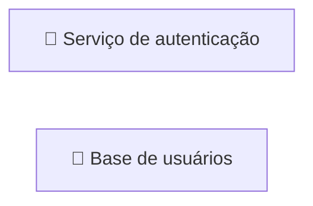

Ruim — poluído:
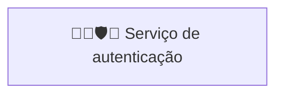

### 3. Combine com texto

O símbolo complementa o rótulo — nunca o substitui.

Bom:
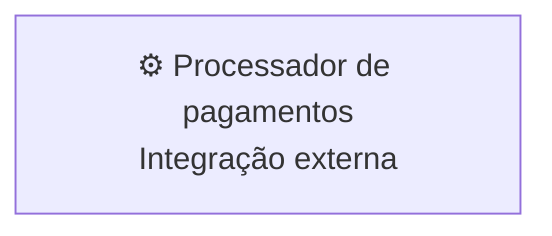

Ruim — sem contexto:
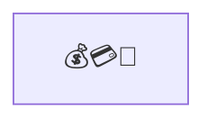

### 4. Compatibilidade de renderização

Alguns símbolos podem não renderizar de forma consistente em todas as
plataformas. Prefira símbolos Unicode bem estabelecidos (até Unicode 13.0)
para máxima compatibilidade.

### 5. Acessibilidade

Leitores de tela leem apenas o texto — o rótulo precisa fazer sentido sem o
símbolo.

Bom:
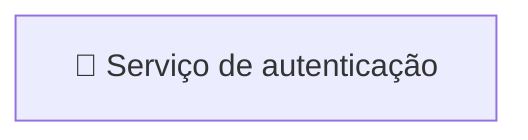

Ruim — leitor de tela só lê "cadeado":
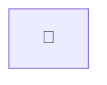
