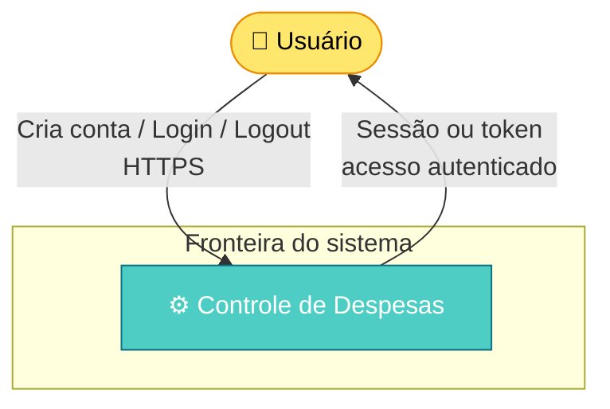
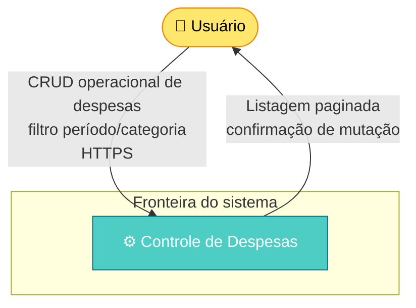
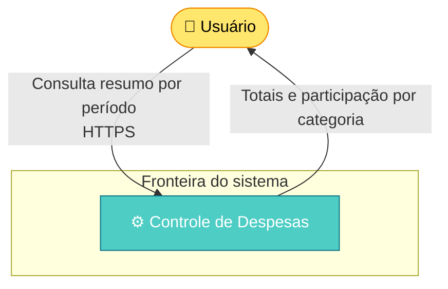
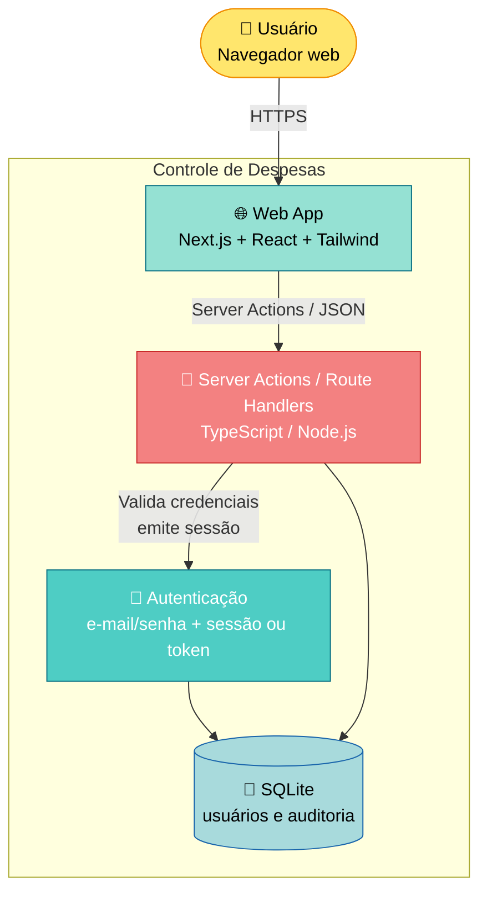
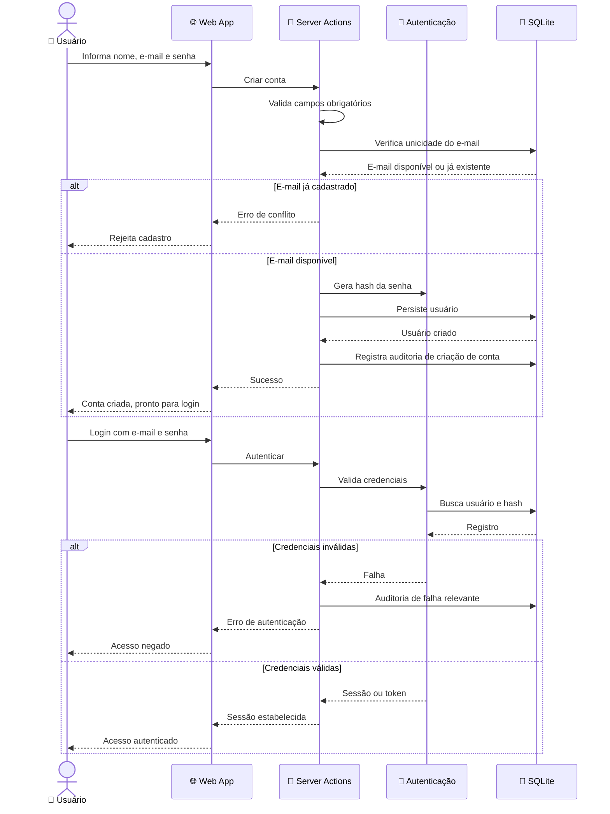
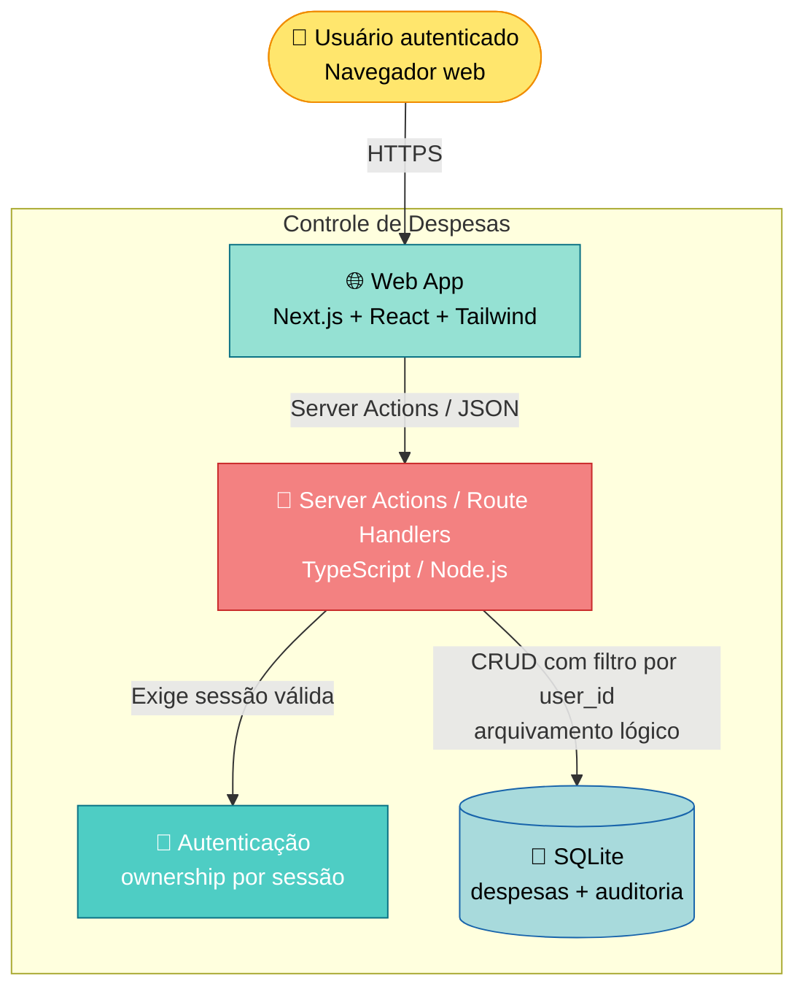
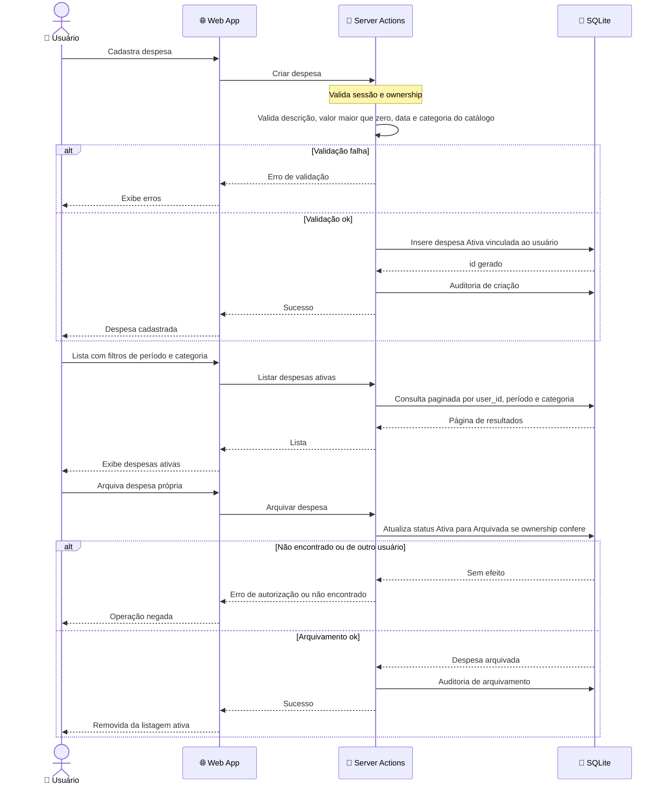
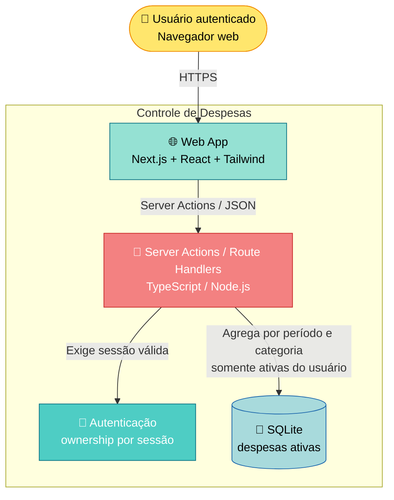
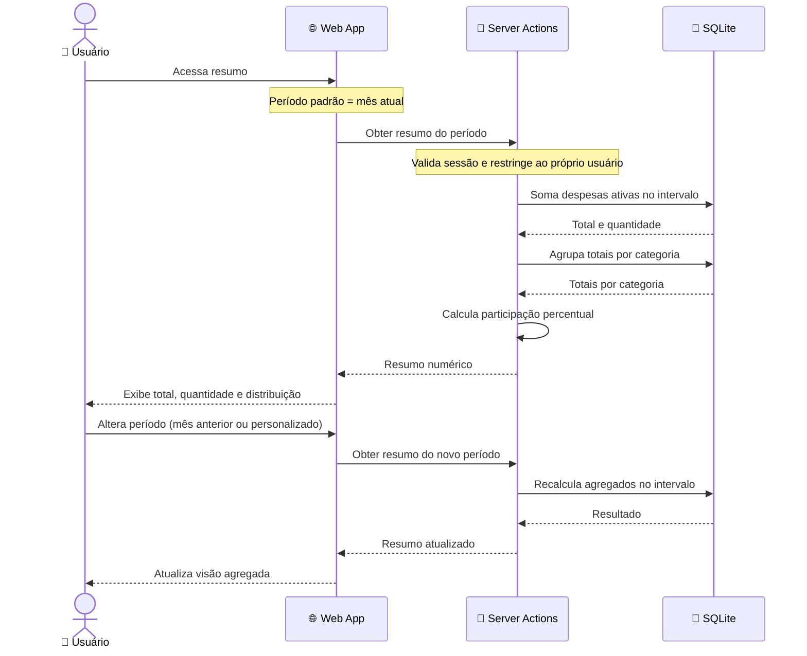

# DAS SSG-1234567 - PROJETO Controle de Despesas

SSG-1234567 — Controle de Despesas (MVP)

## Histórico do documento

| Data | Versão | Autor | Nota Revisão |
|------|--------|-------|---------------|
| 14 Aug 2026 | 0.001 | Gabriel Medeiros | Versão inicial. |

## Projetos que referenciam este documento

| Projeto/PTI | Nome do Projeto | Gerente do Projeto | Data da Solicitação | Tipo de Relacionamento |
|---|---|---|---|---|
| Não aplicável | Não aplicável | Não aplicável | Não aplicável | Não aplicável |

## 1. Visão do Escopo

Este documento descreve a arquitetura de solução do **Controle de Despesas**, aplicação web de uso individual para registro e acompanhamento de despesas pessoais por período e categoria.

Do ponto de vista sistêmico, a entrega consiste em uma **aplicação única full-stack** (Next.js + TypeScript + SQLite) que concentra interface web, regras de negócio no servidor e persistência local ao processo, **sem microsserviços e sem integrações externas no MVP**. TI deve desenvolver: autenticação por e-mail e senha, gestão de despesas com isolamento por proprietário, filtros por período/categoria e resumo numérico agregado.

**Objetivo da solução:** permitir que a pessoa física autentique-se, registre e mantenha despesas classificadas por catálogo fixo, consulte-as com filtros e acompanhe total gasto e distribuição por categoria no período selecionado — de forma rastreável e restrita aos próprios dados.

**Contexto de entrega:** MVP greenfield. Orçamento e prazo: Não informado. A validade desta solução limita-se ao escopo do MVP (sem receitas, cartões, Open Finance, mobile, multi-usuário por conta ou painel administrativo). Atualizações tecnológicas ou mudança de banco/stack principal invalidam premissas deste DAS e exigem revisão.

**Público-alvo:** pessoas físicas em uso pessoal, sem compartilhamento familiar ou empresarial.

## 2. Visão da Solução

### 2.1 Jornada 1: Autenticação

**Breve Descrição da Jornada:**

O Usuário cria conta (nome, e-mail único e senha), realiza login e logout. Sem sessão válida, não acessa despesas nem resumos. Senha é armazenada apenas como hash. Sessão ou token expira conforme política definida na implementação.

**Diagrama de Contexto:**

**Container de Referência:** Controle de Despesas — Autenticação (Web + Server Actions + Auth + SQLite)

**Impactos Mapeados:**

| Sistema | Processo | Impacto | Descrição |
|---|---|---|---|
| Controle de Despesas | Cadastro, login e logout | Desenvolvimento e Testes | Novo fluxo de conta e sessão, unicidade de e-mail, hash de senha e proteção de rotas autenticadas |

### 2.2 Jornada 2: Gestão de despesas

**Breve Descrição da Jornada:**

O Usuário autenticado cadastra, lista (com filtro por período e categoria), edita e arquiva despesas próprias. Cada despesa exige descrição, valor > 0, data e categoria do catálogo fixo. Novas despesas nascem Ativas; arquivamento é transição Ativa → Arquivada (sem exclusão física imediata e sem reabertura no MVP).

**Diagrama de Contexto:**

**Container de Referência:** Controle de Despesas — Gestão de Despesas (Web + Server Actions + SQLite)

**Impactos Mapeados:**

| Sistema | Processo | Impacto | Descrição |
|---|---|---|---|
| Controle de Despesas | Cadastro, consulta, edição e arquivamento | Desenvolvimento e Testes | Persistência de despesas com ownership, validação de regras, arquivamento lógico e catálogo fixo de categorias |

### 2.3 Jornada 3: Resumo de despesas

**Breve Descrição da Jornada:**

O Usuário autenticado consulta o resumo numérico das despesas **ativas** no período: total gasto, quantidade de registros, total e participação percentual por categoria. Período padrão: mês atual; opções incluem mês anterior e período personalizado. Não há visão cross-user.

**Diagrama de Contexto:**

**Container de Referência:** Controle de Despesas — Resumo (Web + Server Actions + SQLite)

**Impactos Mapeados:**

| Sistema | Processo | Impacto | Descrição |
|---|---|---|---|
| Controle de Despesas | Agregação por período e categoria | Desenvolvimento e Testes | Cálculo de resumo apenas sobre despesas ativas do usuário autenticado no intervalo selecionado |

## 3. Considerações

### 3.1 Pontos de atenção

| Ponto | Descrição |
|---|---|
| Jornada 1 | Unicidade global de e-mail e armazenamento de senha apenas com hash. Política de expiração de sessão/token deve ser definida na implementação. |
| Jornada 1 e 2 | Isolamento por proprietário é regra crítica: toda consulta e mutação restringe-se ao usuário autenticado (sem RBAC multi-papel no MVP). |
| Jornada 2 | Exclusão operacional é arquivamento (Ativa → Arquivada). Não há retorno para Ativa nem exclusão física imediata no MVP. |
| Jornada 2 e 3 | Categorias são catálogo fixo do sistema (Alimentação, Transporte, Moradia, Saúde, Lazer, Educação, Outros). Usuário não cria nem edita categorias. |
| Jornada 3 | Resumo ignora despesas arquivadas e usa apenas datas no período selecionado. Datas persistidas em UTC. |
| Transversal | Auditoria das ações críticas (conta, login com falha relevante, criação/edição/arquivamento de despesa) e logs estruturados no servidor. |
| Transversal | Persistência em SQLite em aplicação única: modelo adequado ao MVP, com cuidados de backup/volume no deploy. Hospedagem e ambientes além do local: Não informado. |

### 3.2 Dependências

| PTI | Projeto | Arquiteto de soluções | Descrição da dependência |
|---|---|---|---|
| Não aplicável | Não aplicável | Não aplicável | Nenhuma dependência de outro PTI/projeto identificada na foundation. Sem integrações externas no MVP. |

## 4. Descrição do impacto

| Sistema | IC (Item de Configuração) | Tipo de Impacto |
|---|---|---|
| Controle de Despesas | Aplicação web Next.js (App Router, React, Tailwind/shadcn) | Novo |
| Controle de Despesas | Camada de servidor (Server Actions / Route Handlers) | Novo |
| Controle de Despesas | Autenticação (e-mail/senha, sessão ou token — ex.: Auth.js ou equivalente) | Novo |
| Controle de Despesas | Banco SQLite (usuários, despesas, auditoria) | Novo |
| Controle de Despesas | Suite de testes E2E (Playwright) | Novo |

## 5. Desenho da solução

### 5.1 Jornada 1: Autenticação

**Contexto de Referência:** 2.1 Jornada 1: Autenticação

**Diagrama Container:**

### 5.2 Jornada 2: Gestão de despesas

**Contexto de Referência:** 2.2 Jornada 2: Gestão de despesas

**Diagrama Container:**

### 5.3 Jornada 3: Resumo de despesas

**Contexto de Referência:** 2.3 Jornada 3: Resumo de despesas

**Diagrama Container:**

## 6. Mapeamento de Recursos Sistêmicos

| Item | Tecnologia | Descrição do Recurso | Reuso/Novo/Alterado | Ambiente | Responsável Desenvolvimento | Responsável Sustentação | Responsável Produção |
|---|---|---|---|---|---|---|---|
| Web App | Next.js, React, TypeScript, Tailwind CSS, shadcn/ui | Interface web (App Router) para autenticação, despesas e resumo | Novo | Local / Não informado | Não informado | Não informado | Não informado |
| Camada de servidor | Next.js Server Actions / Route Handlers, Node.js, TypeScript | Validação, regras de negócio, ownership e auditoria | Novo | Local / Não informado | Não informado | Não informado | Não informado |
| Autenticação | Auth.js ou equivalente no ecossistema Next.js | Conta com e-mail/senha (hash), sessão ou token | Novo | Local / Não informado | Não informado | Não informado | Não informado |
| Persistência | SQLite (+ ORM/query builder a definir) | Usuários, despesas (com `archived_at`), auditoria | Novo | Local / Não informado | Não informado | Não informado | Não informado |
| Testes E2E | Playwright | Cobertura das jornadas críticas do MVP | Novo | Local / CI (Não informado) | Não informado | Não informado | Não informado |

## 7. Documentos relacionados

- Não aplicável (nenhum DAS anterior identificado).

## 8. Anexos

- `.specs/foundation/PRD.md`
- `.specs/foundation/BUSINESS-RULES.md`
- `.specs/foundation/GLOSSARY.md`
- `.specs/foundation/STACK.md`
- `docs/INSUMO — Controle de Despesas Pessoais.pdf`

## 9. Links Relacionados

- Foundation: `.specs/foundation/`
- Este DAS: `.specs/das/DAS-SSG-1234567-controle-de-despesas-mvp.md`
